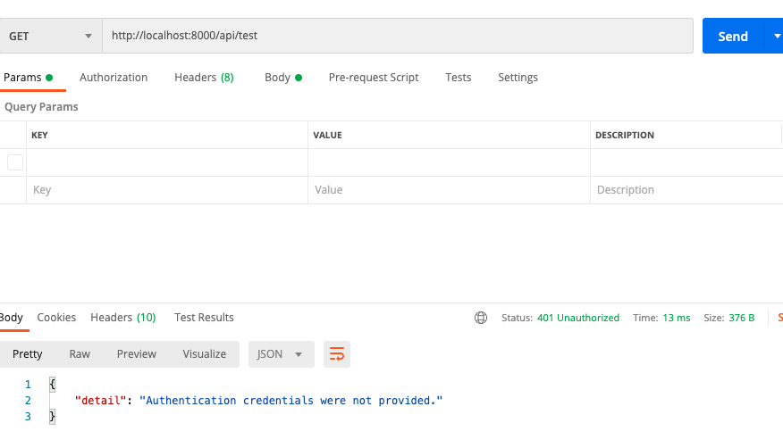
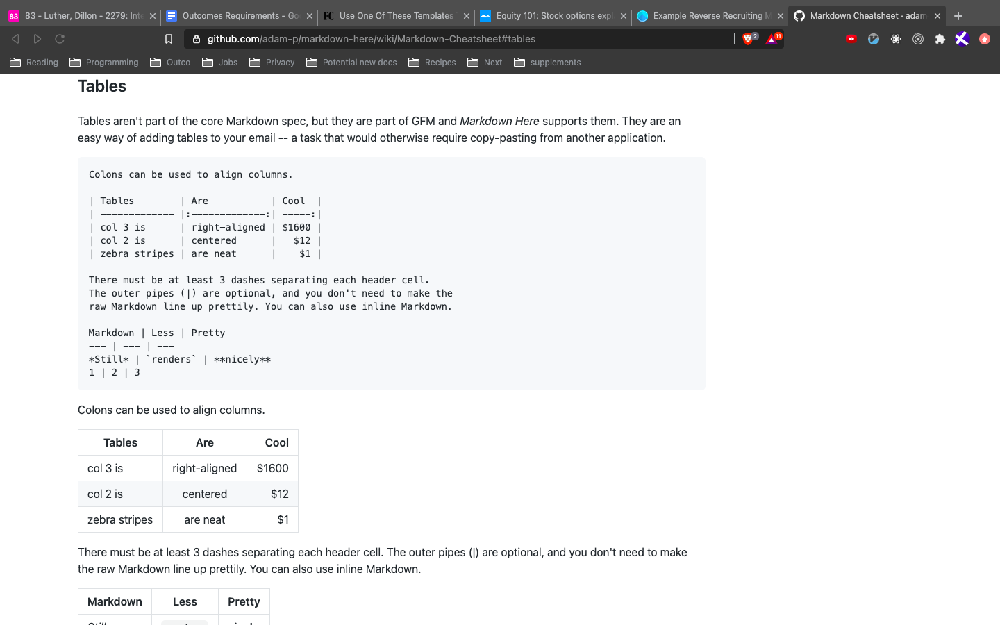
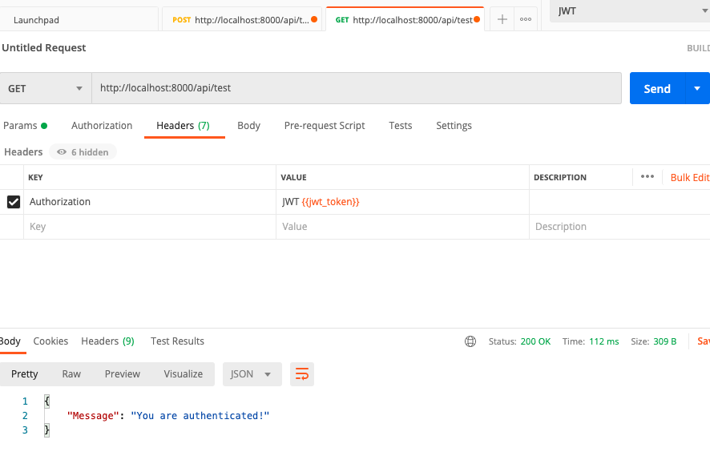
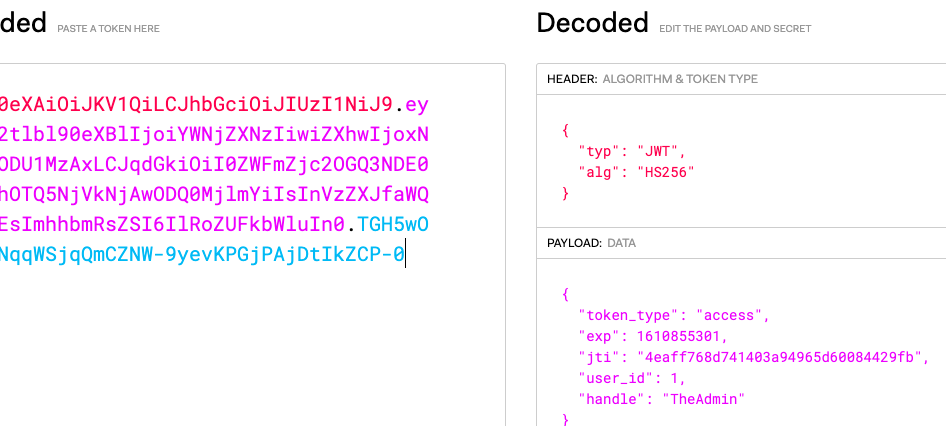

1. pip install `django djangorestframework psycopg`
   1. pip wanted me to upgrade, so I did.
2. `django-admin startproject chatter`
3. `python manage.py startapp backend`
4. Add 'backend' and 'rest_framework' to list of install apps in `settings.py`
5. We want postgres as our database
   1. created postgres database for the project
      1. CLI with `createdb chatterdb` or in psql with `CREATE DATABASE chatterdb;`
      2. psql `create user chatter_user with encrypted password <youwishyouknew>;
      3. `grant all privileges on database chatterdb to chatter_user;`
   2. Add postgres settings to our app in settings.py
      ```
      DATABASES = {
          'default': {
              'ENGINE': 'django.db.backends.postgresql',
              'NAME': 'chatterdb',
              'USER': 'chatter_user',
              'PASSWORD': 'password',
              'HOST': '127.0.0.1', # apparently can also use 'localhost'
              'PORT': '5432', # default is 5432
          }
      }
      ```

6. *BEFORE* any migrations, we need to decide what user we want or it will automatically migrate the standard auth user
  ```
  from django.db import models
  from django.contrib.auth.models import AbstractUser

  class User(AbstractUser):
      handle = models.CharField(blank=False, max_length=24)
  ```
7. Point the `AUTH_MODEL_USER` to our new user in `settings.py` (or makemigrations will fail)
```
AUTH_USER_MODEL = 'authentication.User'
```
8. Register the user in the admin
```
from django.contrib import admin
from .models import User

class UserAdmin(admin.ModelAdmin):
    model = User

admin.site.register(User, UserAdmin)
```
8. Migrate
```
python manage.py makemigrations
python manage,py migrate
```

9. Create superuser

## I did everything before this so far in a separate app called `authentication` and I'm going to try JWT instead of drf auth because it sounds like it's more full fledged. Which means ignor number 9 (remove that from apps)

10. `pip install djangorestframework-simplejwt`
12. update settings to add `rest_framework_simplejwt.authentication.JWTAuthentication` to thea authentication classes
```
REST_FRAMEWORK = {
    'DEFAULT_AUTHENTICATION_CLASSES' : (
        'rest_framework_simplejwt.authentication.JWTAuthentication',
    )
}
```
11. Make routes for `TokenObtainPairView` and `TokenRefreshView`:
```
# authentication/urls.py
from django.urls import path
from rest_framework_simplejwt.views import TokenObtainPairView, TokenRefreshView

urlpatterns = [
    path('token/', TokenObtainPairView.as_view(), name='token_obtain_pair'),
    path('token/refresh/', TokenRefreshView.as_view(), name='token_refresh'),
]

# chatter/urls.py
urlpatterns = [
    ...
    path('api/', include('authentication.urls')),
]
```
12. Can test it with curl requests
```
# Get the token pair
curl \
  -X POST \
  -H "Content-Type: application/json" \
  -d '{"username": "admin", "password": "password"}' \
  http://localhost:8000/api/token/

# refresh the token
curl \
  -X POST \
  --headers "Content-Type: application/json" \
  --data '{"refresh":"<Use the refresh token received from the token pair request>"}' \
    http://127.0.0.1:8000/api/token/refresh/
```
13. settings for the jwt
```
SIMPLE_JWT = {
    'ACCESS_TOKEN_LIFETIME': timedelta(minutes=5),
    'REFRESH_TOKEN_LIFETIME': timedelta(days=14),
    'ROTATE_REFRESH_TOKENS': False,
    # need to add `rest_framework_simplejwt.token_blacklist` if I flip this to true
    'BLACKLIST_AFTER_ROTATION': False,
    # turning to true will drastically increase the number of database queries
    'UPDATE_LAST_LOGIN': False,

    'ALGORITHM': 'HS256',
    'SIGNING_KEY': SECRET_KEY, # from Django, although recommended to use another
    # # don't need when using HMAC Signing (HS...)
    # 'VERIFYING_KEY': None,
    # # audience claim to be included in generated tokens and/or validated in decoded tokens
    # 'AUDIENCE': None,
    # # issuer claim ... above
    # 'ISSUER': None,

    'AUTH_HEADER_TYPES': ('JWT',), # default is 'Bearer'
    'AUTH_HEADER_NAME': 'HTTP_AUTHORIZATION',
    'USER_ID_FIELD': 'id',
    'USER_ID_CLAIM': 'user_id', 

    'AUTH_TOKEN_CLASSES': ('rest_framework_simplejwt.tokens.AccessToken',),
    'TOKEN_TYPE_CLAIM': 'token_type',

    # 'JTI_CLAIM': 'jti',

    # 'SLIDING_TOKEN_REFRESH_EXP_CLAIM': 'refresh_exp',
    # 'SLIDING_TOKEN_LIFETIME': timedelta(minutes=5),
    # 'SLIDING_TOKEN_REFRESH_LIFETIME': timedelta(days=1),
}
```
14. I created a protected view to test authentication
```
# authentication/views.py
from rest_framework.views import APIView
from rest_framework.permissions import IsAuthenticated
from rest_framework.response import Response

class TestView(APIView):
    # we can take this out if we put DEFAULT_PERMISSION_CLASSES to include this in settings
    permission_classes = [IsAuthenticated]

    def get(self, request):
        content = {'Message': 'You are authenticated!'}
        return Response(content)

# authentication/urls.py
urlpatterns = [
    ...,
    # TestView for auth
    path('test/', TestView.as_view(), name='test_auth')
]
```
  * Can either go to the url, or make a curl or postman request to `http://localhost:8000/api/test`, and will see that we don't get the response because we don't have credentials
    1. Try the request without auth:
      
    2. Get the access token (pass in the username and password as json in the body tag), and store the access token as a variable (https://dev.to/loopdelicious/using-jwt-to-authenticate-and-authorize-requests-in-postman-3a5h):
      
    3. Try the request passing in the token, and voila!
       
15. OPTIONAL: create a custom claim so the JWT includes something in addition to user_id, such as `handle` in our case. To do this:
  1. We make a subclass of the `TokenObtainPairSerializer` from `rest_framework_simplejwt.serializers`:
    ```
    # authentication/serializers.py
    from rest_framework_simplejwt.serializers import TokenObtainPairSerializer

    # A Custom Claim for JWT, so we can see the handle passed along with the token
    class CustomTokenObtainPairSerializer(TokenObtainPairSerializer):
        @classmethod
        def get_token(cls, user):
            """
            docstring
            """
            token = super(CustomTokenObtainPairSerializer, cls).get_token(user)

            # Add custom claim
            token['handle'] = user.handle
            return token
    ```
  2. views
    ```
    from rest_framework.permissions import ..., AllowAny
    from .serializers import CustomTokenObtainPairSerializer
    from rest_framework_simplejwt.views import TokenObtainPairView

    ...

    class TokenObtainPairWithHandleView(TokenObtainPairView):
        permission_classes = (AllowAny,) # only need this if DEFAULT_PER... is somethign like isAuthenticated
        serializer_class = CustomTokenObtainPairSerializer
    ```
  3. new urls
    ```
    from django.urls import path
    from rest_framework_simplejwt.views import TokenObtainPairView, TokenRefreshView
    from .views import TestView, TokenObtainPairWithHandleView

    urlpatterns = [
        # path('token/', TokenObtainPairView.as_view(), name='token_obtain_pair'),
        # if we use the custom claim with the handle
        path('token/', TokenObtainPairWithHandleView.as_view(), name='token_obtain_pair'),
        path('token/refresh/', TokenRefreshView.as_view(), name='token_refresh'),
        # TestView for auth
        path('test/', TestView.as_view(), name='test_auth')
    ]
    ```
    
  * And then when I test the token on https://jwt.io, I see the claim includes the handle I added:
    

16.  make the user serializer
  * learned some things about modelSerializer, extra_kwargs, etc.
```
class UserSerializer(serializers.ModelSerializer):
    # writing the attributes here will remove any defaults
    email = serializers.EmailField(required=True)
    handle = serializers.CharField(required=True)
    password = serializers.CharField(min_length=8, write_only=True)
    
    class Meta:
        model = User # required
        fields = ['email', 'handle', 'password'] # fields or exclude required

        # # adding things to extra_kwargs will override overlap, but maintain existing defaults
        # extra_kwargs = {
        #     'password': {'write_only': True},
        #     'handle': {'required': True},
        #     'email': {'required': True},
        # }
    
    def create(self, validated_data):
        password = validated_data.pop('password') # pop this so we can hash it
        instance = self.Meta.model(**validated_data)
        if password is not None:
            instance.set_password(password)
        instance.save()
        return instance
```
17. Create user view
```
class UserCreate(CreateAPIView):
    permission_classes = (AllowAny,)
    serializer_class = UserSerializer
```


## ~~~~~~~~~~~~~~~~~~~~~~~~~~~~~~~~~~~~~~~~~~~
## below this was from original attempt prior to JWT auth 
1.  I then created an admin user:
   1. `python manage.py createsuperuser`, gave it a name, email, and password
      1. I can now see this user in the users table
   2. I can see the fields on the model if I go into the shell and import User and check the _meta fields:
      ```
      from django.contrib.auth.models import User

      User._meta.fields
      # If I want to shoe the relatioships too, I can use get_fields()
      User._meta.get_fields()
      # For just the names, I can use a list comp or map
      [f.name for f in User._meta.fields]
      ```
2.  Before I get carried away, I'll make sure I can see React. since I'm trying to figure out auth with relation to the frontend. Before any DRF stuff or whatever, let's do webpack, babel, and react. `npm init` to create your package.json file.
3.  `npm install --save-dev webpack webpack-cli  "webpack-bundle-tracker@<1" @babel/core babel-loader @babel/preset-env @babel/preset-react react react-dom`
   3.  Something about webpack bundle tracker needed to be lower than 1. I'll have to check.
4.  create `webpack.config.js`
   ```
   const path = require('path');
   const BundleTracker = require('webpack-bundle-tracker');
   // const { CleanWebpackPlugin } = require('clean-webpack-plugin');

   module.exports = {
     // the base directory for resolveing the entry option
     // context: __dirname
     // The entry point that will have all the js, don't need extension because of resolve
     entry: '.index',
     output: {
       // where we want the bundle to go
       path: path.resolve('./assets/bundles/'),
       // convention for webpack
       filename: '[name]-[hash].js',
       // below solved the publicPath issue with autoMain
       // publicPath: ''
     },
     plugins: [
       // new CleanWebpackPlugin(),
       // stores data about bundles here
       new BundleTracker({
         filename: './webpack-stats.json'
       })
     ],
     module: {
       rules: [
         {
           // tells webpack to use the below loaders on all jsx and jsx files
           test: [/\.jsx?$/, /\.js?$/],
           // avoid node modules cause this will take forever
           exclude: /node_modules/,
           loader: 'babel-loader',
         }
       ]
     },
     resolve: {
       // extensions to resolve modules
       extensions: ['.js', '.jsx']
     }
   }
   ```
12. create `.babelrc`
   ```
   {
     "presets": ["@babel/preset-env", "@babel/preset-react"]
   }
   ```
11. Create js file where React hooks in:
    1.  `mkdir -p assets/js`, `touch assets/js/index.js`
12. `index.js`
13. `templates/index.html` so react has the element to hook into
14. Integrate React with Django
    1.  `pip install django-webpack-loader`
    2.  add `webpack_loader` to apps in settings
    3. show webpack loader where to find the bundles:
       ```
       STATICFILES_DIRS = (
           os.path.join(BASE_DIR, 'assets'),
       )

       WEBPACK_LOADER = {
           'DEFAULT': {
               'BUNDLE_DIR_NAME': 'bundles/',
               'STATS_FILE': os.path.join(BASE_DIR, 'webpack-stats.json')
           }
       } 
       ```
    4. update tamplate dirs in settings:
       ```
       TEMPLATES = [
           {
               'BACKEND': 'django.template.backends.django.DjangoTemplates',
               'DIRS': [os.path.join(BASE_DIR, 'templates')], # <-- this line
               'APP_DIRS': True,
               'OPTIONS': {
                   'context_processors': [
                       'django.template.context_processors.debug',
                       'django.template.context_processors.request',
                       'django.contrib.auth.context_processors.auth',
                       'django.contrib.messages.context_processors.messages',
                   ],
               },
           },
       ]
       ```
    5. Make sure '/' goes to the index html template. To do this, update top level url conf, `urls.py`:
       ```
       from django.contrib import admin
       from django.urls import path
       from django.views.generic import TemplateView # <-- added this

       urlpatterns = [
           path('admin/', admin.site.urls),
           path('', TemplateView.as_view(template_name='index.html')) # <-- added this
       ]
       ```

### User Auth Notes
1. Need to specify custom user before first migration
   1. First don't forget to register the app
2. In models, import `AbstractUser` from `django.contrib.auth.models`
3. Make a `User` class that inherits from `AbstractUser`
4. In settings, add `AUTH_USER_MODEL = '<app_name>.User` so it knows where to find this new user.
5. Then, since we created a new model, run `python manage.py makemigrations <app_name>`, and then `python manage.py migrate`
6. If you want it available in the admin panel, go to admin.py to register the User
   ```
   from django.contrib import admin
   from .models import User

   # Register your models here.
   admin.site.register(User)
   ```
7. To access the model, can't do normal import. User `django.contrib.auth.get_user.model()`
   1. in shell run `from django.contrib.auth import get_user_model`
   2. `get_user_model().objects.all()` gets all users